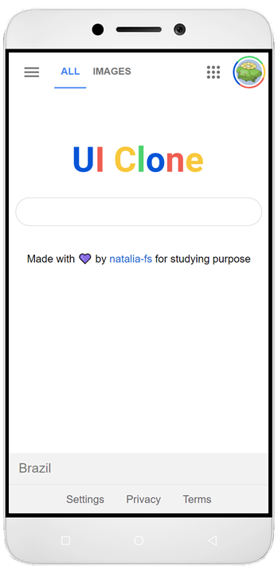

## Google UI-Clone

### Clone responsivo da interface da homepage do Google (sem as funcionalidades) usando apenas HTML e CSS.
#### Feito para fins de estudo, inspirado no [episódio](https://youtu.be/KgjzE1Sxtq0) de UI Clone do [Guilherme Rodz](https://github.com/guilhermerodz) (Rocketseat).

___

    

